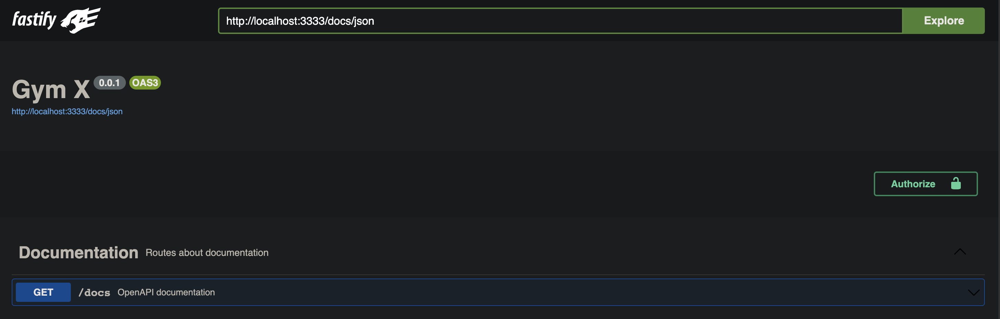
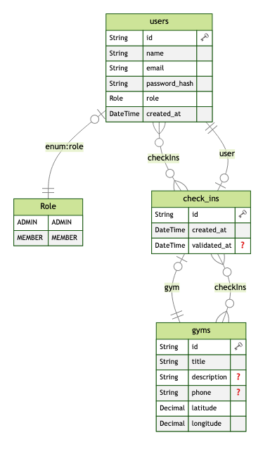

# Gym X

## O que é necessário para testar essa aplicação?

- Ter o [Node.js](https://nodejs.org/en) instalado acima da versão 18.12.1;
- Ter o gerenciador de pacotes [Yarn](https://yarnpkg.com/) instalado;
- Algum Rest Client: [Insomnia](https://insomnia.rest/download), [Postman](https://www.postman.com/), [cURL](https://curl.se/), [Thunder](https://www.thunderclient.com/);

## Tecnologias utilizadas

- [Node.js](https://nodejs.org/)
- [TypeScript](https://www.typescriptlang.org/)
- [Fastify](https://www.fastify.io//)
- [Prisma](https://www.prisma.io/)
- [PostgreSQL](https://www.postgresql.org/)
- [JWT](https://jwt.io/)
- [Bcrypt](https://www.npmjs.com/package/bcrypt)
- [Vitest](https://vitest.dev/)
- [Supertest](https://www.npmjs.com/package/supertest)
- [Dayjs](https://www.npmjs.com/package/dayjs)
- [Zod](https://zod.dev/)
- [Swagger](https://swagger.io/)
- [Docker](https://www.docker.com/)

## Variáveis de Ambiente

Para rodar esse projeto, você vai precisar adicionar as seguintes variáveis de ambiente no seu .env

**API**

`PORT`

`NODE_ENV`

**DB**

`DATABASE_URL`

**JWT**

`JWT_SECRET`

## Rodando Localmente

Clone o projeto

```bash
  git clone https://github.com/flpcastro/gym-x-api.git
```

Entre no diretório do projeto

```bash
  cd gym-x-api
```

Instale as dependências

```bash
  yarn
```

Suba o banco de dados via Docker

```bash
  docker-compose up -d
```

Inicie o servidor

```bash
  yarn dev
```

## Rodando Testes Unitários

Clone o projeto

```bash
  git clone https://github.com/flpcastro/gym-x-api.git
```

Entre no diretório do projeto

```bash
  cd gym-x-api
```

Instale as dependências

```bash
  yarn
```

Rode os testes

```bash
  yarn test
```

## Rodando Testes Unitários

Clone o projeto

```bash
  git clone https://github.com/flpcastro/gym-x-api.git
```

Entre no diretório do projeto

```bash
  cd gym-x-api
```

Instale as dependências

```bash
  yarn
```

Suba o banco de dados via Docker

```bash
  docker-compose up -d
```

Rode os testes e2e

```bash
  yarn test:e2e
```

## Funcionalidades

**Requisitos Funcionais**

- [x] Deve ser possível se cadastrar;
- [x] Deve ser possível se autenticar;
- [x] Deve ser possível obter o perfil de um usuário logado;
- [x] Deve ser possível obter o número de check-ins realizados pelo usuário logado;
- [x] Deve ser possível o usuário obter seu histórico de check-ins;
- [x] Deve ser possível o usuário buscar academias próximas (até 10km);
- [x] Deve ser possível o usuário buscar academias pelo nome;
- [x] Deve ser possível o usuário realizar check-in em uma academia;
- [x] Deve ser possível validar o check-in de um usuário;
- [x] Deve ser possível cadastrar uma academia;

**Regras de Negócio**

- [x] O usuário NÃO deve poder se cadastrar com um e-mail duplicado;
- [x] O usuário NÃO pode fazer 2 check-ins no mesmo dia;
- [x] O usuário NÃO pode fazer check-in se não estiver perto (100m) da academia;
- [x] O check-in só pode ter validado até 20 minutos após criado;
- [x] O check-in só pode ser validado por administradores;
- [x] A academia só pode ser cadastrada por administradores;

**Requisitos Não Funcionais**

- [x] A senha do usuário precisa estar criptografada;
- [x] Os dados da aplicação precisam estar persistidos em um banco PostgreSQL;
- [x] Todas as listas de dados precisam estar paginadas com 20 itens por página;
- [x] O usuário deve ser identificado por um JWT (JSON Web Token);

# Documentation

<div align="center">
    
    
</div>

## Endpoints

### Swagger Documentation

```http
  GET /docs
```

### User

**Criação**

```http
  POST /users
```

| Parâmetro  | Tipo     | Descrição                          |
| :--------- | :------- | :--------------------------------- |
| `email`    | `string` | **Obrigatório**. Email do Usuário. |
| `name`     | `string` | **Obrigatório**. Nome do Usuário.  |
| `password` | `string` | **Obrigatório**. Senha do Usuário. |
| `role`     | `string` | Role do Usuário. (ADMIN ou MEMBER) |

**Autenticação**

```http
  POST /sessions
```

| Parâmetro  | Tipo     | Descrição                          |
| :--------- | :------- | :--------------------------------- |
| `email`    | `string` | **Obrigatório**. Email do Usuário. |
| `password` | `string` | **Obrigatório**. Senha do Usuário. |

**Refresh Token**

```http
  PATCH /api/cadastro/users/id/{id_pessoa_demeter}
```

| Parâmetro  | Tipo     | Descrição                          |
| :--------- | :------- | :--------------------------------- |
| `email`    | `string` | **Obrigatório**. Email do Usuário. |
| `password` | `string` | **Obrigatório**. Senha do Usuário. |

**Buscar dados do perfil**

```http
  GET /me
```

### Gym

**Criação**

```http
  POST /gyms
```

| Parâmetro     | Tipo     | Descrição                               |
| :------------ | :------- | :-------------------------------------- |
| `title`       | `string` | **Obrigatório**. Nome da Academia.      |
| `description` | `string` | Descrição da Academia.                  |
| `phone`       | `string` | Contato da Academia.                    |
| `latitude`    | `number` | **Obrigatório**. Latitude da Academia.  |
| `longitude`   | `number` | **Obrigatório**. Longitude da Academia. |

**Buscar várias**

```http
  GET /gyms/search
```

_Query_

| Parâmetro | Tipo     | Descrição                 |
| :-------- | :------- | :------------------------ |
| `query`   | `string` | **Obrigatório**. Query.   |
| `page`    | `number` | Pagina que deseja buscar. |

**Buscar academias próximas**

```http
  GET /gyms/nearby
```

_Query_

| Parâmetro   | Tipo     | Descrição                                      |
| :---------- | :------- | :--------------------------------------------- |
| `latitude`  | `number` | **Obrigatório**. Latitude que o usuário está.  |
| `longitude` | `number` | **Obrigatório**. Longitude que o usuário está. |

### Check In

**Criação pelo ID do produtor**

```http
  POST /gyms/{gymId}/check-ins
```

_Params_

| Parâmetro | Tipo     | Descrição                        |
| :-------- | :------- | :------------------------------- |
| `gymId`   | `string` | **Obrigatório**. ID da Academia. |

_Body_

| Parâmetro   | Tipo     | Descrição                              |
| :---------- | :------- | :------------------------------------- |
| `latitude`  | `number` | **Obrigatório**. Latitude do Usuário.  |
| `longitude` | `number` | **Obrigatório**. Longitude do Usuário. |

**Buscar histórico de check-ins**

```http
  GET /check-ins/history
```

**Buscar métricas de check-in do Usuário**

```http
  GET /check-ins/metrics
```

**Validar Check-in**

```http
  PATCH /check-ins/:checkInId/validate
```

_Params_

| Parâmetro   | Tipo     | Descrição                        |
| :---------- | :------- | :------------------------------- |
| `checkInId` | `string` | **Obrigatório**. ID do Check-In. |

- Exemplo de Payload:

```json
{
  "email": "johndoe@mail.com",
  "nm_pessoa": "John Doe",
  "password": "123456"
}
```

- Exemplo de Requisição:

```sh
curl -X POST \
  http://localhost:3333/users \
  -H 'Cache-Control: no-cache' \
  -H 'Content-Type: application/json' \
  -d '{
        "email": "johndoe@mail.com",
        "nm_pessoa": "John Doe",
        "password": "123456"
    }'
```

## Autores

- [@flpcastro](https://www.github.com/flpcastro)
